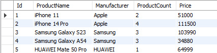

# Урок 1. Установка СУБД, подключение к БД, просмотр и создание таблиц

### 1. Создайте таблицу с мобильными телефонами, используя графический интерфейс. Заполните БД данными

USE sql_ds01;

SELECT * FROM sql_ds01.phones;

### 2. Выведите название, производителя и цену для товаров, количество которых превышает 2

SELECT ProductName, Manufacturer, Price FROM sql_ds01.phones WHERE ProductCount > 2;

### 3. Выведите весь ассортимент товаров марки "Samsung"

SELECT * FROM sql_ds01.phones WHERE Manufacturer = 'Samsung';

### 4. Выведите информацию о телефонах, где суммарный чек больше 100 000 и меньше 145 000

SELECT * FROM sql_ds01.phones WHERE (Price * ProductCount) > 100000 AND (Price * ProductCount) < 145000;